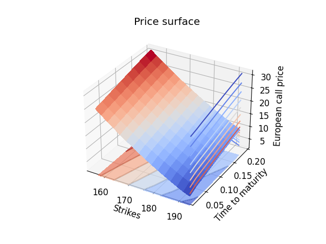
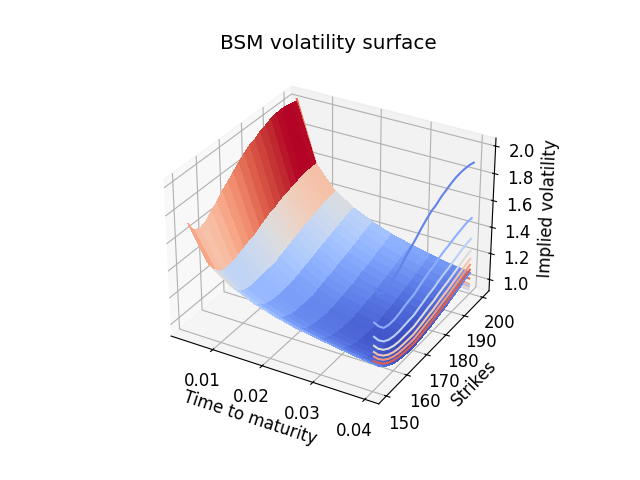
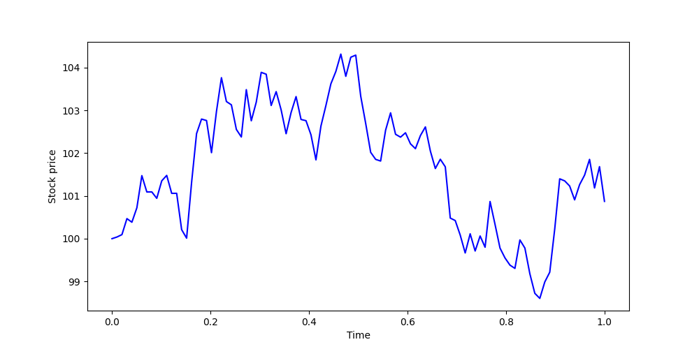
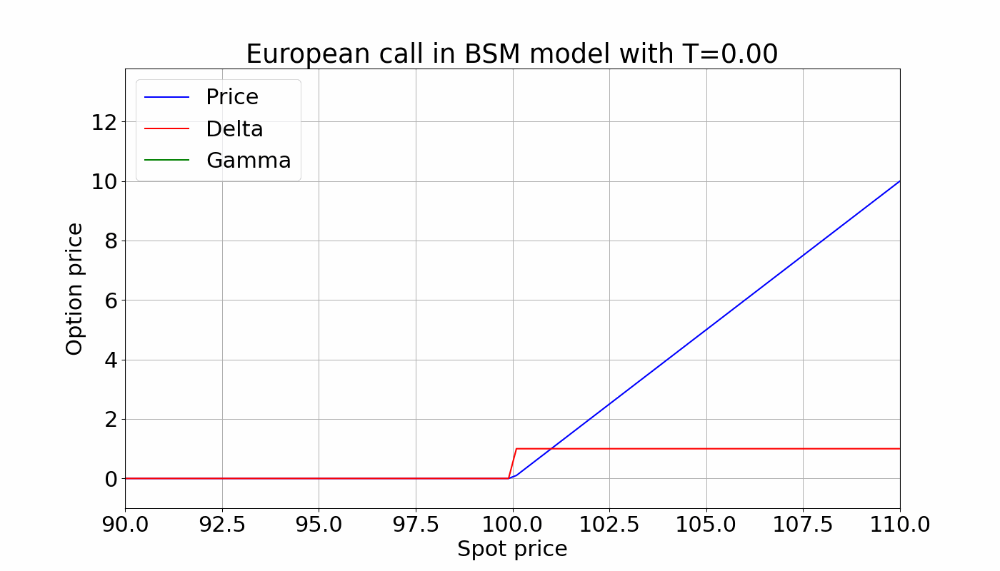

# Quantitative Finance with C++
This repository contains a code basis for quantitative methods in finance, coded in C++ and visualized using Python. 

As a first example of the methods in the repo, we can calibrate the Black-Scholes-Merton implied volatility to an option price surface. In this case, we are considering a Eurpoean call option on an underlying with spot price $175, strikes ranging from $150 to $200 and maturities ranging from 1 to 10 weeks. The risk free rate and dividend yield are assumed to be 4.5% and 0.7% respectively. We use the Adam optimizer (a variant of gradient descent) for calibration of the model. Below, the price surface and corresponding volatility surface are plotted.

European call price surface            |  European call BSM impled Vol
:-------------------------:|:-------------------------:
 |  

The repository contains tools to simulate stochastic processes modelling stock prices. The example plot below shows three paths of a Heston model, used to to model stock prices with a stochastic volatility process.

  

Canonical models for derivative pricing are included. The below plot shows the development of the fair price, Delta and Gamma of a european call option with strike $100 in the Black-Scholes-Merton model as time to maturity increases.

  

