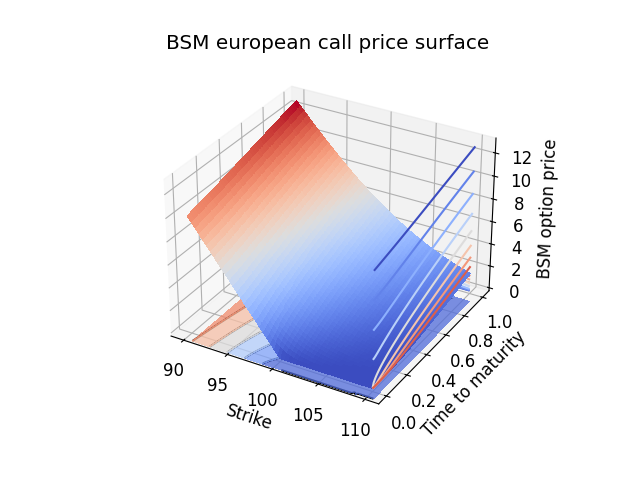
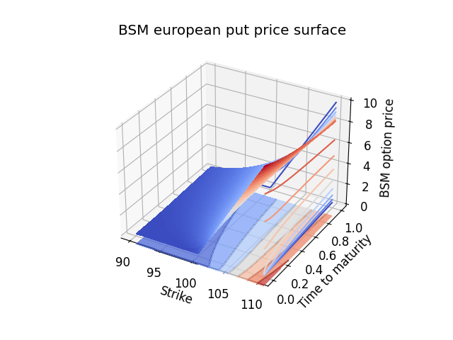

# Quantitative Finance with C++
This repository contains a code basis for quantitative methods in finance, coded in C++ and visualized using Python. 

As an example application, the below plot showcases the price surfaces in the Black-Scholes-Merton model for european call and put options.

European call             |  European put
:-------------------------:|:-------------------------:
 |  

The repository contains tools to simulate stochastic processes modelling stock prices. The example plot below shows three paths of a Heston model, used to to model stock prices with a stochastic volatility process.

  

Canonical models for derivative pricing are included. The below plot shows the development of the price, Delta and Gamma of a european call option with strike 100$ in the Black-Scholes-Merton model as time to maturity increases.

  

