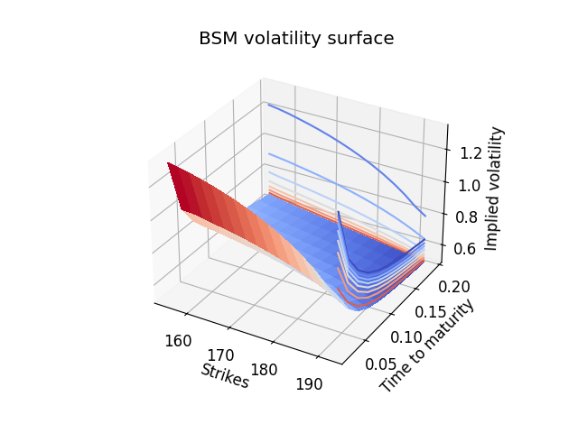
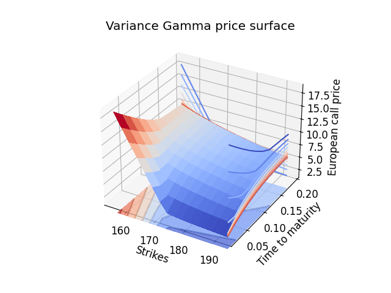

# Quantitative Finance with C++
This repository contains a code basis for quantitative methods in finance, coded in C++ and visualized using Python. 

As a first example of the methods in the repo, we can calibrate the Black-Scholes-Merton implied volatility to an option price surface. In this case, we are considering a Eurpoean call option on an underlying with spot price $175, strikes ranging from $155 to $192.5 and maturities ranging from 1 to 10 weeks. The risk free rate and dividend yield are assumed to be 4.5% and 0.7% respectively. We use the Adam optimizer (a variant of gradient descent) for calibration of the model. Below, the price surface and corresponding volatility surface are plotted.

European call price surface            |  European call BSM impled Vol
:-------------------------:|:-------------------------:
 |  

The Black-Scholes-Merton implied volatility varies for different strikes and maturities. No single volatility parameter is sufficient to accurately replicate the price surface, which is a clear sign of the limitations of the BSM model (the above price surfaces is artificial, but the effect can be even more pronounced for real options). If we calibrate the BSM model to the above price surface, we get a best fit with a vol of 0.62 leading to a mean relative squared error of 0.04 on the prices. 
A more flexible model than BSM is the Heston model, in which the volatility itself follows its own stochastic process (which may be correlated to the price). Contrary to the single vol of the BSM model, the Heston model contains 5 adjustable parameters. Calibrating a Heston model to the above price surface, we can achieve a mean relative squared error of 0.02, half of the BSM error. Below, we show the price surfaces generated by the two models.

BSM calibrated price surface            |  Heston calibrated price surface
:-------------------------:|:-------------------------:
 |  

Both models have a hard time fitting the exact curvature of the true surface, but the slope of the curve can be seen to be more accurate in the Heston model, particularly for large times to maturity. For this plot, the BSM surface is calibrated using the analytical pricing formula. No analytical formula is available for the Heston model, but the prices can be approximated, e.g. via the characteristic function and Fast Fourier Transform, which is used in the calibration.

The repository also contains tools to simulate the stochastic processes modelling stock prices, which can be useful for Monte-Carlo based techniques. The example plot below shows three paths of a Heston model, used to to model stock prices with a stochastic volatility process.

  

Canonical models for derivative pricing and Hedging are included. The below plot shows the development of the fair price, Delta and Gamma of a european call option with a strike of $100 in the Black-Scholes-Merton model as time to maturity increases.

  

